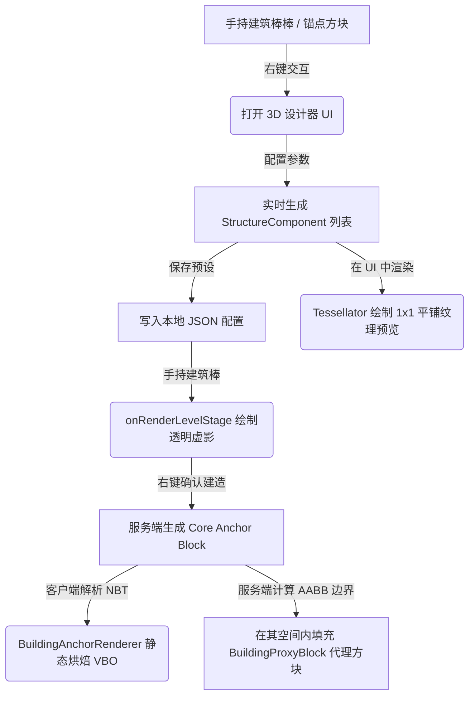

# 云构模组 (Cloud Tectonics) - 开发与架构说明文档

本文件旨在详细描述“云构模组”的项目结构、技术路线、已实现功能以及对应的代码文件位置，方便后续使用其他 AI 编码助手或进行手动二次开发。

---

## 1. 项目基本信息
- **游戏版本**：Minecraft 1.20.1
- **构建工具**：Gradle 8.8
- **模组平台**：Minecraft Forge 47.4.20
- **主要特性**：参数化古建生成（大木作）、思考（Ponder）风格 3D 营造编辑器、手持虚影预览与 15° 步长任意角度旋转、基于 VBO 烘焙的 O(1) Draw Call 高性能客户端渲染、以及物理碰撞代理方块。

---

## 2. 项目目录与结构
所有 Java 源代码文件位于：`src/main/java/com/example/cloudtectonics/`。

```
com.example.cloudtectonics/
│
├── cloudtectonicsMod.java                      # 模组主类 (注册表初始化、事件总线绑定)
│
├── block/                                       # 方块定义
│   ├── BuildingAnchorBlock.java                 # 建筑中心锚点方块 (处理右击打开 UI、物理代理方块的生成/清除)
│   └── BuildingProxyBlock.java                  # 物理代理方块 (提供古建在世界中的实际碰撞箱、重定向交互至锚点)
│
├── blockentity/                                 # 方块实体
│   ├── BuildingAnchorBlockEntity.java           # 锚点方块实体 (存储营造参数、组件列表、整体旋转、自定义渲染包围盒)
│   └── BuildingProxyBlockEntity.java            # 代理方块实体 (存储关联的锚点方块坐标)
│
├── registry/                                    # 注册管理包
│   ├── ModBlocks.java                           # 方块注册
│   ├── ModBlockEntities.java                    # 方块实体注册
│   ├── ModItems.java                            # 物品注册 (建筑锚点棒)
│   └── ModCreativeModeTabs.java                 # 创造模式创造栏注册
│
├── item/                                        # 物品定义
│   └── BuildingWandItem.java                    # 建筑锚点棒 (右击开启建造虚影，Shift+右击打开预设列表，32格超远射击)
│
├── math/                                        # 数学几何与参数化生成核心
│   ├── StructureComponent.java                  # 构件数据类 (存储局部Pos、Size、Rotation、Texture与Color)
│   ├── GomedricTransformer.java                 # 几何变换与碰撞辅助 (包含 AABB vs OBB 分离轴定理 SAT 相交计算、动态体素化碰撞提取)
│   ├── ParametricBuildingGenerator.java          # 参数化几何生成引擎 (大木作歇山大样数学逻辑，生成全部方块构件)
│   └── BuildingDebugLogger.java                 # 调试日志记录与参数导出工具
│
├── network/                                     # 现代网络数据包
│   ├── ModMessages.java                         # 网络通道注册
│   ├── ServerboundPlaceBuildingPacket.java      # 请求服务端开始物理建造数据包
│   ├── ServerboundUpdateBuildingPacket.java     # 服务端同步更新锚点建筑参数数据包
│   └── ServerboundUpdateWandNBTPacket.java      # 客户端同步手持物品 NBT（朝向/预设）数据包
│
└── client/                                      # 客户端渲染与 UI 交互 (物理隔离，非客户端环境下不加载)
    ├── ClientModEvents.java                     # 客户端 Setup、Renderer 绑定、Keybind 注册
    ├── ClientForgeEvents.java                   # 客户端事件监听 (手持虚影渲染、滚轮旋转、左击取消、Debug F10 碰撞可视化、Debug HUD 按钮)
    ├── ClientAccess.java                        # 客户端安全访问接口 (防服务端类加载崩溃)
    ├── PresetManager.java                       # 预设配置文件读取/保存管理器 (cloudtectonics_presets.json)
    ├── PresetSelectionScreen.java               # 营造预设选择面板 (滚动选择、设计新预设)
    ├── BuildingConfigurationScreen.java         # 营造编辑器 (3D交互式预览视口、滚动参数栏、图层过滤开关)
    └── BuildingAnchorRenderer.java              # 静态烘焙渲染器 (利用 VBO 缓存合并 Draw Call)
```

此外，在项目根目录下还包含独立的外部前端建模工具：
```
/editor/                                         # 外部 3D 参数化构件可视化编辑器
├── public/                                      # 静态资源与 UI
│   ├── index.html                               # 编辑器结构与建模工具栏 (W/R/D/Del 快捷键支持)
│   ├── style.css                                # 现代玻璃拟态 Dark 风格界面样式
│   └── app.js                                   # Three.js 渲染、TransformControls 3D 轴交互、参数化双向同步公式解析器
└── server.js                                    # Node.js/Express 本地持久化后端 (自动扫包、读取/回写模组 Java 代码)
```

---

## 3. 技术路线与渲染管线
本模组的核心在于**“参数化配置 $\rightarrow$ 客户端单 Draw Call 渲染 $\rightarrow$ 服务端物理代理方块填充”**。



### 3.1 客户端渲染流程 (Client-Side Rendering)
- **VBO 静态烘焙 (`BuildingAnchorRenderer.java`)**：
  - 传统中式大木作由成百上千个木构件组成。如果采用普通的瞬时绘制，会造成大量的 CPU-GPU 传输开销。
  - 本模组在方块实体数据变化或首次加载时，调用 `bakeVertices`，利用 `BufferBuilder` 将所有构件的信息（位置、颜色、平铺纹理、光照度）写入一个 `VertexBuffer` (VBO) 存入显存。
  - 每一帧渲染时，直接执行 `vbo.drawWithShader(...)`。此时渲染开销为 **$O(1)$ Draw Call**，运行效率极高。
- **1x1 方块面单元分割与平铺 (Grid Tiling Subdivision)**：
  - 所有的构件都是通过拉伸后的立方体 box（如 `comp.size`）表示。如果直接拉伸纹理，会造成贴图模糊失真；而直接增加 UV 坐标会导致超出纹理图册（Texture Atlas Sprite）中单张贴图的 `[u0, u1]`/`[v0, v1]` 边界，采样到相邻的无关贴图（如花屏、红绿条纹）。
  - **解决方案**：在 `BuildingAnchorRenderer.java`、`BuildingConfigurationScreen.java` 和 `ClientForgeEvents.java` 的立方体面绘制中，对于每个面，按 `1.0f`（1格）的步长划分为若干个 `1x1` 的网格单元。在绘制每个网格单元时，根据局部坐标差值计算正确的比例，在 `[u0, u1]` 范围内平铺纹理。此法彻底解决了纹理拉伸、贴图越界导致的闪烁与花屏问题。

### 3.2 物理代理方块机制与 OBB 碰撞对齐 (Collision & Interaction with OBB SAT Alignment)
- **碰撞体问题**：由于古建是一个宏大的整体，但本质上只有中心一个 `BuildingAnchorBlock` 方块，如果不做处理，玩家会穿过整栋建筑，无法产生真实的物理碰撞与互动。
- **旋转碰撞箱变形问题**：当建筑朝向不为 0° 时，构件在世界空间中呈倾斜状态（Oriented Bounding Box, OBB）。如果直接用其外接的 AABB 粗筛检测，会导致代理方块在世界坐标轴对齐的网格中大面积膨胀铺设，产生大范围不可穿透的“空气墙”。
- **解决方案**：
  - **分离轴定理 (SAT) 算法**：在 `GomedricTransformer.java` 中引入 SAT 算法测试 15 条可能的轴（3条世界法轴、3条构件局部轴、9条叉乘轴），计算 AABB 方块与构件 OBB 之间的精确空间相交性。
  - **阶梯网格紧密铺设**：当确定建造或进行碰撞判定时，系统先利用 AABB 粗筛，再通过 SAT 算法精准过滤。只有当网格坐标真正碰触到倾斜模型的几何体积时，才会在该处铺设物理代理方块 `BuildingProxyBlock`，将生成的 BlockEntity 数量缩减 80% 以上，并彻底消除空白区域的空气墙。
  - **动态体源化碰撞提取**：客户端与服务端统一调用 `GomedricTransformer.calculateProxyShape`。在获取每个代理方块的 `VoxelShape` 形状时，系统会筛选并求交所有接触该方块的构件 OBB，生成亚像素精度的复合碰撞外壳，满足玩家真实站立、踩踏与行走需求。
- **重定向交互**：代理方块在被玩家右击、破坏或左击攻击时，会将请求与碰撞点重定向并转发给底部的中心 `BuildingAnchorBlock`。例如，右击大殿任意台基或柱头处的代理方块，可以直接打开该中心锚点的 3D 营造编辑器。

### 3.3 视锥体裁剪优化 (Frustum Culling)
- **问题**：若玩家的镜头移开大殿的最底部中心点，即使屋顶和柱子仍在视野内，整栋建筑也会瞬间消失。
- **解决方案**：在 `BuildingAnchorBlockEntity.java` 中重写了 `getRenderBoundingBox()` 方法，使其根据所有组件的 AABB 并集动态返回世界空间的完整包围盒。只要大殿的任意部位被镜头扫过，视锥体裁剪检查就会通过，保证大殿稳定渲染。

---

## 4. 关键功能与对应代码位置

### 4.1 参数化大木作生成引擎
- **逻辑位置**：[ParametricBuildingGenerator.java](file:///c:/Users/jyh/Desktop/coding/Chinese_building_test/mod_test1/src/main/java/com/example/cloudtectonics/math/ParametricBuildingGenerator.java)
- **工作机制**：`generate(...)` 方法接收包含开间数、进深数、柱高、起翘、斗拱等级的参数，依次生成以下组件：
  1. `buildBase`：台基与柱础石。
  2. `buildColumns`：圆柱（朱红）。
  3. `buildBeamsAndTies`：额枋、金枋、随梁枋，以及五架梁、三架梁等抬梁叠落梁架，包含两端的绿、蓝彩画条带装饰。
  4. `buildPurlins` 与 `buildPurlinSupports`：檩条、滚脊泥与木瓜柱支托。
  5. `buildRafters`：飞椽、檐椽，包含檐口的角起翘数学曲线。
  6. `buildRoof` 与 `buildBofengAndRuyi`：屋面瓦层、正脊、垂脊、山花板、博风板。

### 4.2 材质与颜色映射
- **逻辑位置**：
  - 常量定义：`ParametricBuildingGenerator.java:15-26`
  - 映射转换：各渲染类的 `getTexturePath(StructureComponent comp)`
- **映射映射关系**：
  - **屋面青瓦**：`COLOR_SLATE_GREY (0xFF707A80)` $\rightarrow$ `minecraft:block/deepslate_tiles` （已调浅，便于看清瓦片纹理）
  - **朱红圆柱/额枋**：`COLOR_VERMILION (0xFF9A2A22)` $\rightarrow$ `minecraft:block/stripped_mangrove_log`
  - **梁架/檩条/椽条**：`COLOR_NATURAL_WOOD (0xFFB58450)` $\rightarrow$ `minecraft:block/stripped_spruce_log`
  - **仔角梁/木作**：`COLOR_YOUNG_CORNER_BEAM (0xFFD4A76A)` $\rightarrow$ `minecraft:block/stripped_spruce_log`
  - **描金/正脊饰件**：`COLOR_GOLD_PAINT (0xFFCDA234) / COLOR_GLAZED_GOLD_TILE (0xFFD4AF37)` $\rightarrow$ `minecraft:block/gold_block`
  - **台基/柱础石**：`COLOR_STONE_BASE (0xFF7B828A)` $\rightarrow$ `minecraft:block/stone_bricks`
  - **山花板/山墙**：`COLOR_GABLE_WALL (0xFFBF5D38)` $\rightarrow$ `minecraft:block/red_terracotta`
  - **绿旋子彩画**：`COLOR_JADE_GREEN (0xFF1E5A44)` $\rightarrow$ `minecraft:block/white_concrete`（通过颜色着色）
  - **蓝旋子彩画**：`COLOR_INDIGO_BLUE (0xFF1D3557)` $\rightarrow$ `minecraft:block/white_concrete`

### 4.3 思考（Ponder）式 3D 营造编辑器
- **逻辑位置**：[BuildingConfigurationScreen.java](file:///c:/Users/jyh/Desktop/coding/Chinese_building_test/mod_test1/src/main/java/com/example/cloudtectonics/client/BuildingConfigurationScreen.java)
- **关键设计**：
  - **左侧滚动栏**：仅宽 `160px`，集成了所有滑块（`ParameterSlider`）和控制按钮，且实现了当鼠标位于 `X <= 165` 时可用滚轮上下滑动参数。在此滚动栏外的元素会自动被隐藏并拦截点击。
  - **右侧 3D 视口**：占满屏幕其余空间。按住左键拖拽旋转模型视角，滚动鼠标滚轮放大/缩小（`zoom`）。
  - **比例尺**：右下角提供 2D 文字比例尺，且 3D 辅助网格的角落配有高精度的 **红色 5米长 3D 标尺棒**，方便直观衡量古建体量。
  - **图层过滤器**：可在 UI 中自由隐藏或显示瓦片、斗拱等图层（通过 `showRoof` 等 NBT 同步）。

### 4.4 建造虚影与 15° 任意角度旋转
- **逻辑位置**：[ClientForgeEvents.java](file:///c:/Users/jyh/Desktop/coding/Chinese_building_test/mod_test1/src/main/java/com/example/cloudtectonics/client/ClientForgeEvents.java)
- **工作机制**：
  - 手持建筑棒时，在 `onRenderLevelStage` 事件中发射射线，计算放置位置，并渲染 `alpha = 0.5f` 的半透明构件虚影。
  - **15° 旋转**：拦截鼠标滚轮事件，滚动时手持的预设朝向旋转 15°，并发送网络包 `ServerboundUpdateWandNBTPacket` 同步至服务端。这打破了传统方块只能 90° 旋转的限制。
  - **左击取消**：拦截左击攻击事件，快捷清空已选预设，退出建造模式。

### 4.5 隐形物理代理方块 3D 透视可视化器
- **逻辑位置**：[ClientForgeEvents.java](file:///c:/Users/jyh/Desktop/coding/Chinese_building_test/mod_test1/src/main/java/com/example/cloudtectonics/client/ClientForgeEvents.java) 中的 `renderProxyCollisionBoxes`
- **使用方法**：按下 **F10** 键开启 Debug 日志记录模式时，会在世界中渲染出所有代理方块的包围盒。
- **渲染特征**：
  - **X-Ray 透视**：强制关闭深度测试（Depth Test），使得埋入地面或模型内部的碰撞箱均能以高优先级线框显示，防止遮挡。
  - **青色框（Cyan）**：显示控制底座（`BuildingAnchorBlock`）的 $1\times1\times1$ 原点线框。
  - **黄色框（Yellow）**：显示代理方块（`BuildingProxyBlock`）的 $1\times1\times1$ 空间包络边界，用于确定哪些网格被标记为了代理。
  - **绿色框（Green）**：在黄色框内以 $1/16$ 亚像素精度渲染构件实际的物理相交 VoxelShape 碰撞网格，供开发阶段快速对齐校验。

### 4.6 外部 3D 可视化参数化编辑器 (External Visual CAD Web Editor)
- **位置**：`/editor/`
- **核心模块**：
  - **3D Gizmo 控制器 (TransformControls)**：利用 Web 端的 Three.js 提供了类似 Blockbench 的可视化平移（W键）、缩放（R键）轴线柄，可直接通过鼠标在 3D 预览中拉伸修改木构件。
  - **亚像素网格吸附**：支持 $1/16$ 像素（`0.0625`）、$1/8$、$1/4$、$1/2$ 等多档精度吸附，确保手拉出的坐标完美对齐原版体素网格。
  - **双向参数化同步 (Parametric Binder)**：对于构件的任一尺寸或坐标，支持在 `Constant` (常量模式) 与 `Parametric` (参数模式) 间切换。参数模式下可绑定特定自变量（如 `height`、`bays`），编辑时拉动 3D 轴会自动解算并实时重写构件的 `offset` 偏置公式。
  - **持久化回写**：编写了专用的 Java 文件 AST 替换引擎，前端点击保存后由后台 `server.js` 解析并直接替换对应工厂类（如 `ColumnFactory.java`）中硬编码的 Java 代码块，实现“编辑器设计 $\rightarrow$ 保存即代码”的无缝闭环。

---

## 5. 开发者编译与测试指令
- **测试代码编译**（确认没有语法或 API 错误）：
  ```powershell
  ./gradlew compileJava
  ```
- **完整打包**（生成 jar 包至 `build/libs/`）：
  ```powershell
  ./gradlew build
  ```
- **沙盒运行**（启动测试客户端）：
  ```powershell
  ./gradlew runClient
  ```

---

## 6. 未来开发计划与架构重构建议
为了支持更复杂的古建类型（如岳阳楼、滕王阁）并解决当前的渲染和建造局限，规划了以下三大核心未来特性：

### 6.1 骨架节点驱动与“材份制”模块化系统 (Modular Assembly & Skeleton Node Graph)
- **解决对齐与穿模**：不再使用独立的绝对三维坐标公式计算每个构件位置，而应建立**骨架节点树**（例如立柱顶端节点、各檩条轴心点）。梁架、椽条等构件的长度、旋转完全由其两端挂接的骨架节点决定（例如：每段椽条都是两檩条顶部接触点之间的连线向量）。这样，当参数发生变化时，结构绝对对齐，无悬空和穿模。
- **材份制比例比例**：定义最基础的“材”与“分”模块单位（例如一材为0.2米），所有构件尺寸（柱径、梁厚、斗拱的斗宽等）都以“材/分”为比例基准，使整体结构能像经典营造法式一样按比例完美缩放。
- **重檐与多层楼阁 (Multi-story Structure)**：实现垂直链式 Story 数组层叠机制，使上层底部 Y 坐标基于下层高度自动计算并收分（收缩柱网），支持岳阳楼、滕王阁等多层重檐复杂古建的参数化开发。

### 6.2 构件级局部破坏与保留系统 (Component-Level Partial Destruction & Preservation)
- **实现局部拆除**：在 `StructureComponent` 中引入生命值或销毁标记。当玩家左击挖掘某个位置的物理代理方块（`BuildingProxyBlock`）时，拦截破坏事件（阻止整栋建筑直接销毁的默认行为）。
- **高精视线求交检测 (Raycasting)**：获取玩家视角射线，与该格内叠加的所有构件包围盒（AABB）进行实际相交点判定，精确识别出玩家指向的具体子构件（例如只拆除了最外面的瓦片，而瓦片底下的椽条依然保留）。
- **动态 VBO 重绘**：标记破坏的组件为已销毁，更新客户端 VBO 剔除该组件渲染。只有当某格内的所有构件均被破坏后，才拆除对应的物理代理方块。

### 6.3 高精度亚像素级吸附式内饰系统 (High-Precision Snapping Interior Decoration System)
- **虚拟内饰子组件**：在 `BuildingAnchorBlockEntity` 中使用专门的 `List<DecorationComponent>` 存储家具，其坐标支持完全自由的浮点数三维局部坐标，不占用原版独立方块空间，可实现多内饰共用一格。
- **物理表面精准吸附 (Surface Snapping)**：放置家具时，利用射线检测出古建构件表面（如地面顶面、墙体侧面）的真实几何相交点 $(X,Y,Z)$，将家具高度吸附对齐到该表面（如贴墙壁挂、地面摆放），并支持任意角度旋转。
- **亚像素碰撞箱融合 (VoxelShape Union)**：在代理方块的 `getCollisionShape` 中收集并拼合当前格内所有内饰组件的 AABB 形成复杂的融合 `VoxelShape`，提供精度高达 $1/16$ 格网（或更高）的实体踩踏碰撞体验。

### 6.4 牌匾对联文字与挂画自定义系统 (Plaques, Couplets & Hanging Scrolls Customization System)
- **预设边框模型与文字区域**：定义标准规格的 3D 模型（如 1x3, 1x5 等规格的牌匾、对联竹简、石碑额），并在模型表面标记好特定的 2D 编辑区域（Quads 材质表面），作为文字或画作的贴图投射媒介。
- **PPT式文字排版与 Java AWT 动态绘制**：在客户端利用 Java 的 `java.awt.Graphics2D` 在内存中创建高分辨率（如 256x128, 512x256, 甚至是 1024x512 像素）的 `BufferedImage`：
  - 允许玩家在 UI 中输入内容，并像 PPT 文本框一样自由设置：横排/竖排、对齐方式、字体大小、字间距、行间距、字体阴影、描边金边以及背景底纹。
  - 支持玩家将外部字体文件（`.ttf` / `.otf`）放入游戏 `config/cloudtectonics/fonts/` 目录，模组动态加载这些字体，并在内存中进行反走样高精渲染，最后将 `BufferedImage` 上传至 Minecraft 客户端的 `DynamicTexture`（动态纹理），渲染到模型上，呈现极具中式书法美感的文字。
- **自定义挂画导入与自适应裁剪**：玩家可将本地图片（PNG/JPG）放入 `config/cloudtectonics/paintings/` 目录：
  - 模组读取图片后，使用 Java 2D 图形学引擎，根据挂画画幅（如立轴、横幅、团扇、屏风）的宽高比进行**自动缩放与自适应裁剪**（类似于网页 CSS 的 `object-fit: cover` 效果），防止图片拉伸变形。
  - 上传至动态纹理绑定，使玩家可以在古建中自由悬挂高清壁画。

---
*注：本说明文档已被保存在项目根目录下，文件名为 [开发说明文档.md](file:///c:/Users/jyh/Desktop/coding/Chinese_building_test/mod_test1/%E5%BC%80%E5%8F%91%E8%AF%B4%E6%98%8E%E6%96%87%E6%A1%A3.md)。在后续开发或提示其他 AI 助手时，可直接读取此文档以快速切入项目架构。*


